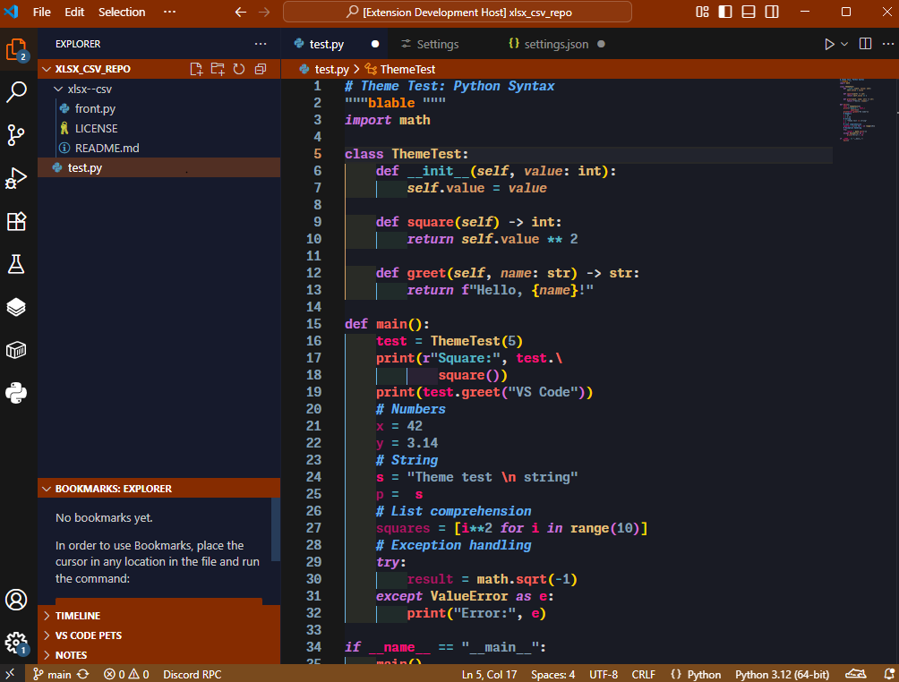

# Doems Sunset Theme for VS Code

A beautiful Visual Studio Code color theme inspired by the vibrant hues of a sunset. This theme brings warm oranges, deep blues to your coding environment, creating a calming and visually appealing workspace.

## Features
- Warm but dark, sunset-inspired color palette

## Installation
1. Open Visual Studio Code.
2. Go to the Extensions view by clicking the square icon in the sidebar or pressing `Ctrl+Shift+X`.
3. Search for `Doems Sunset Theme`.
4. Click **Install** to add the theme to your editor.
5. Go to `Preferences: Color Theme` and select **Doems Sunset Theme**.

## Screenshots

## Contributing
Feel free to open issues or submit pull requests to improve the theme. Suggestions for color tweaks or additional language support are welcome!

## License
MIT